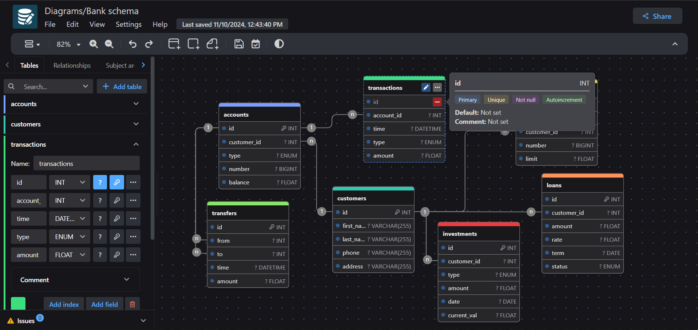

<div align="center">
  <sup>Special thanks to:</sup>
  <br>
  <a href="https://www.warp.dev/drawdb/" target="_blank">
    
    <br>
    <b>Next-gen AI-powered intelligent terminal for all platforms</b>
  </a>
</div>

<br/>

<p align="center">
  <a href="./README.md">English</a> · <a href="./README.zh-CN.md">简体中文</a>
</p>

<br/>

<div align="center">
    
    <h1>drawDB</h1>
</div>

<h3 align="center">Free, simple, and intuitive database schema editor and SQL generator.</h3>

<div align="center" style="margin-bottom:12px;">
    <a href="https://drawdb.app/" style="display: flex; align-items: center;">
        
    </a>
    <a href="https://discord.gg/BrjZgNrmR6" style="display: flex; align-items: center;">
        
    </a>
    <a href="https://x.com/drawDB_" style="display: flex; align-items: center;">
        
    </a>
</div>

<p align="center">
  <sub>🍴 This project is a fork of <a href="https://github.com/drawdb-io/drawdb">drawdb-io/drawdb</a>, adding multi-user accounts, JWT auth, SQLite persistence, and per-diagram collaboration.</sub>
</p>

<h3 align="center"></h3>

DrawDB is a robust and user-friendly database entity relationship diagram (ERD) editor right in your browser. Build diagrams with a few clicks, export and import SQL scripts, generate migrations, customize your editor, and more.

> This fork adds **multi-user accounts, JWT-based authentication, SQLite persistence, and real-time diagram collaboration** — the Gist-based sharing model has been replaced with first-class user accounts and per-diagram collaborator management.

## Features
- Visual ERD editor with SQL export/import, DBML, and migration generation
- Multi-user accounts with admin / member roles
- Per-diagram **collaborator management** — invite any user by username to co-edit
- Per-collaborator **permissions** (`read` or `edit`) — the owner can switch any collaborator's role at any time from the Share panel
- Field **display name** support; SQL / DBML / documentation exports merge `displayName` and `comment` as `displayName; comment`
- Local SQLite persistence (data lives on your server, not in the browser)
- JWT-based authentication (7-day tokens by default)
- Single-binary deployment via Docker (one process serves both the API and the built frontend)

## Getting Started

### Local Development

Requires **Node.js 20+**.

```bash
git clone https://github.com/benchiang/drawdb-team
cd drawdb-team
npm install
npm run dev
```

This starts two processes concurrently:
- **Vite dev server** on `http://localhost:5173` (frontend with HMR)
- **Express API server** on `http://localhost:3001` (auth, diagrams, collaborators, templates)

Vite proxies `/api/*` to the Express server, so you only open `http://localhost:5173`.

**First-time setup:** open the app, you'll be redirected to `/login`. Since the database is empty, the login page will offer a "bootstrap" form — create the first admin account (default credentials in dev: `admin` / `admin`).

### Production Build

```bash
npm install
npm run build      # builds frontend into ./dist
```

In production, the Express server (`server/src/index.js`) automatically detects `./dist` and serves it as static files, with SPA fallback to `index.html` for client-side routes. No Nginx needed.

```bash
node server/src/index.js   # serves both API and frontend on :3001
```

### Docker

```bash
docker build -t drawdb-team .
docker run -d \
  --name drawdb-team \
  -p 3001:3001 \
  -v drawdb-data:/app/server/data \
  --restart unless-stopped \
  drawdb-team
```

The image builds the frontend, installs the server's production dependencies only, and starts Express on port `3001`. SQLite is stored in a named volume `drawdb-data` at `/app/server/data`.

- Open `http://localhost:3001`
- First visit shows the bootstrap form → create the initial admin
- Subsequent visits show the login page

> A `compose.yml` is also provided as a convenience — same image, same volume, just declarative. Use either approach.

**Via docker compose (recommended):**

```bash
docker compose up -d --build
```

This is equivalent to the `docker build` + `docker run` commands above: same image tag (`drawdb-team:latest`), same named volume (`drawdb-data`), same port mapping (`3001:3001`), and the same env vars inlined in `compose.yml`. Tear down with `docker compose down` — the named volume is preserved, so your SQLite data survives.

**Configuration** (environment variables in [compose.yml](compose.yml), plaintext by design):

> For local `npm run dev`, the codebase default for `CORS_ORIGIN` is `http://localhost:5173` (the Vite dev port); the values below are the production defaults baked into `compose.yml`.

| Variable | compose.yml value | Description |
|---|---|---|
| `PORT` | `3001` | Express listen port |
| `JWT_SECRET` | dev fallback | **Change in production** |
| `JWT_EXPIRES_IN` | `7d` | Token lifetime |
| `ADMIN_USERNAME` | `admin` | Bootstrap admin username |
| `ADMIN_PASSWORD` | `admin` | **Change in production** |
| `CORS_ORIGIN` | `http://localhost:3001` | Allowed origin for browser requests |
| `DB_PATH` | `server/data/drawdb.sqlite` | SQLite file location |

**Backup SQLite data:**
```bash
docker run --rm -v drawdb-data:/d -v $PWD:/o alpine cp /d/drawdb.sqlite /o/backup.sqlite
```

## Multi-User & Collaboration

- The first user created via bootstrap becomes **admin** and can manage all users from `/users`
- Each diagram has an **owner** (who can delete it and manage collaborators) and zero or more **collaborators**, each with an independent **permission**: `read` (view-only) or `edit` (full editing)
- Open a diagram → click **Share** (top-right) → type a username, pick a permission (`read` / `edit`, defaults to **edit**) → confirm to invite
- On the Dashboard, the **"Shared with me"** section lists shared diagrams with a `Shared` (edit) or `Read only` (read) badge so collaborators can tell at a glance what they can do

## Contributing

Please see [CONTRIBUTING.md](CONTRIBUTING.md) for guidelines on how to contribute to this project.

## Support
- Join discussions: [Discord](https://discord.gg/BrjZgNrmR6)
